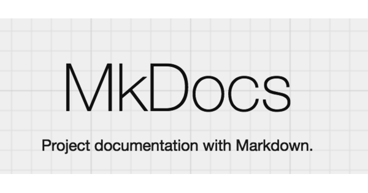

# Prefeitura de Passo Fundo

Passo Fundo é uma cidade localizada no interior do estado do Rio Grande do Sul, conhecida como a capital nacional da literatura.

  
  

## Sobre o Projeto

Este repositório tem como objetivo documentar o projeto do grupo 2 da matéria de **Interação Humano Computador** da Universidade de Brasília, ministrada pelo professor **André Barros de Sales**.

O material de estudo escolhido foi o site da [Prefeitura de Passo Fundo](http://www.pmpf.rs.gov.br/), no qual iremos utilizar as técnicas aprendidas ao longo do semestre e propor mudanças significativas para melhor usuabilidade de suas funcionalidades.

## Equipe

	

        

            <figure class="figure">
                <a href="https://github.com/kayrocesar"><figcaption class="figure-caption text-center"> Kayro </figcaption></a>
            </figure>
		

		

            <figure class="figure">
                <a href="https://github.com/klmurussi">
                    
                    <figcaption class="figure-caption text-center"> Kathlyn </figcaption>
                </a>
            </figure>
		

		

            <figure class="figure">
			    <a href="https://github.com/SwampTG">
                <figcaption class="figure-caption text-center"> Adrian <figcaption></a>
            </figure>
		

	

	

		

            <figure class="figure">
			    <a href="https://github.com/lorenzo7377"><figcaption class="figure-caption text-center"> Lorenzo </figcaption></a>
            </figure>
		

		

            <figure class="figure">
			    <a href="https://github.com/magnluiz"><figcaption class="figure-caption text-center"> Thalisson </figcaption></a>
            </figure>
		

	

## Ferramentas

| Ícone |  Ferramenta  |  Para que serve  | 
| :-: | :-: | :-: |
|| GitHub | Plataforma de hospedagem de documentos com controle de versão utilizando Git, através dela que resolvemos as issues |
|| Whatsapp | Principal ferramenta de comunicação, onde discutimos sobre o projeto e a matéria |
|| Trello | Aplicativo de gerenciamento de projeto, onde decidimos o que é pra fazer, o que estamos fazendo e o que está concluído |
|| Discord | Aplicativo de voz, usamos para nos reunir e decidir o que fazer na próxima sprint |
|| Teams | Ferramenta utilizada para gravação de apresentações   |
|| Mkdocs | Ferramenta utilizada para contruir a Wiki do projeto   |
|| Visual Studio Code  | Ferramenta utilizada edição dos códigos do projeto|
|| Google Sheets | Ferramenta utilizada para elaborar planilhas   |
|| Figma | Ferramenta utilizada para contruir interfaces de interação com usuário   |
|| InVision | Ferramenta utilizada elaborar protótipos   |

<figcaption>Tabela 1- Ferramentas utilizadas.</figcaption>

## Versionamento

 | **Data**   | **Versão** | **Descrição**                            |                **Autor(es)**                 |
 | ---------- | :--------: | ---------------------------------------- | :------------------------------------------: |
 | 10/02/2022 |    1.0     | Criação da lista de ferramentas             |         Kathlyn Lara        |
 | 11/02/2022 |    1.1     | Acréscimo de mais ferramentas            |         Kayro César       |
 